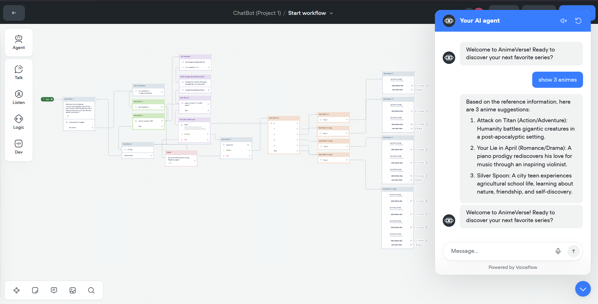
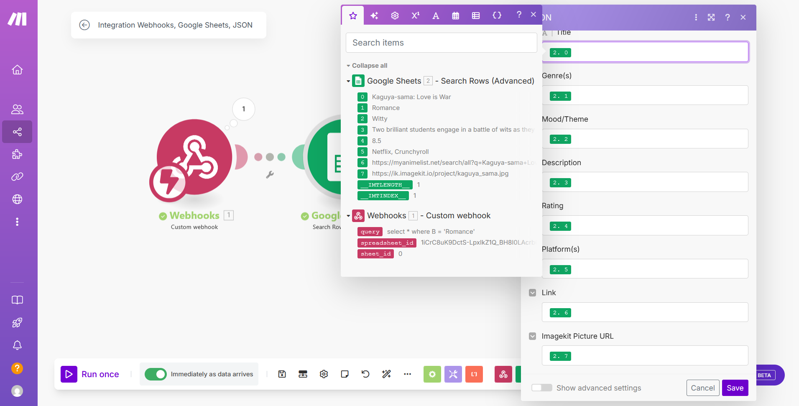
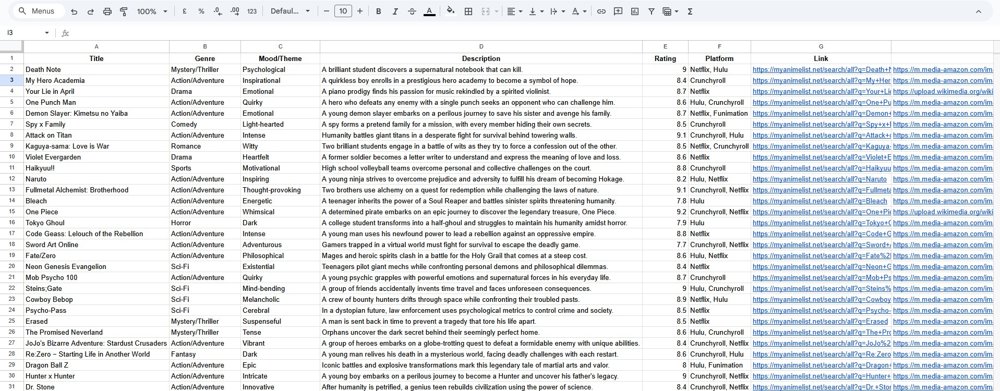

# 🎌 AI-Powered Anime Recommendation Chatbot

  <em>A conversational AI assistant that discovers anime based on your mood, genres, and past favorites.</em>

## 📖 Overview
The **AI-Powered Anime Recommendation Chatbot** is a passion project built to blend modern conversational AI with real-time web automation. It provides users with highly personalized anime recommendations by parsing natural language inputs (like their current mood or favorite genres) and querying live data. 

This project explores the power of **no-code and low-code** ecosystems to deploy smart, accessible, AI-driven applications rapidly.

## 📸 Visuals & Demonstrations

**1. Live Working Bot Video Demo**  

  <a href="[INSERT YOUTUBE/GOOGLE DRIVE LINK HERE]">View the working video demo here</a>

**2. Voiceflow Interface & Recommendations**  

**3. Make.com Automation Integrations**  

**4. Project Logic & Custom Code**  
*(Voiceflow Javascript Code configurations for parsing API results)*  

**5. Backend Knowledge Base & Spreadsheets**  

*(Visual representation of the knowledge constraints)*

## ✨ Key Features
- **Conversational Intelligence:** Engages contextually to understand user preferences and anime tastes.
- **Real-Time Personalization:** Interprets specific moods and genres to curate precise anime suggestions.
- **Live Data Integration:** Hooks securely into the **MyAnimeList API** for up-to-date and expansive anime data.
- **Cross-Platform Accessibility:** Deploys a seamless web-based chat widget designed for high usability.

## 🛠️ Technologies Used
- **[Voiceflow](https://www.voiceflow.com/):** For designing the conversational logic, dialog tree, and user flow.
- **[Make.com](https://www.make.com/):** For workflow automation, handling webhook triggers, and routing API calls.
- **[MyAnimeList API](https://myanimelist.net/apiconfig/references/api/v2):** Core data provider for scraping and fetching anime metrics and metadata.

## 📂 Resources
- See the raw knowledge base strings and constraints inside `assets/knowledgebase(proj1).txt`.

## 🚀 Development Timeline
**March 2025 - April 2025**

---

Developed by <a href="https://github.com/SlayerHADES">Kshitij</a>

